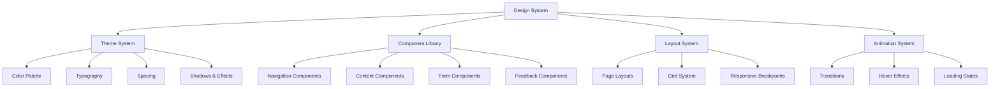
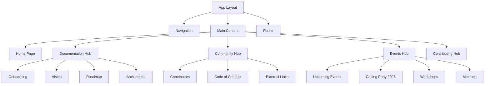

# Design Document

## Overview

This design document outlines the implementation of a Discord-inspired UI/UX system for the OpenLaunch website, including a complete component library, missing pages, and modern design patterns that provide users with a familiar, polished experience.

## Architecture

### Design System Architecture



### Page Architecture



## Components and Interfaces

### Discord Color System

```typescript
// Discord-inspired color palette
const colors = {
  // Background colors
  background: {
    primary: '#36393f',    // Main background
    secondary: '#2f3136',  // Secondary background
    tertiary: '#202225',   // Sidebar/nav background
    elevated: '#40444b',   // Elevated surfaces
  },
  
  // Text colors
  text: {
    primary: '#ffffff',    // Primary text
    secondary: '#b9bbbe',  // Secondary text
    muted: '#72767d',      // Muted text
    link: '#00b0f4',       // Links
  },
  
  // Brand colors
  brand: {
    primary: '#5865f2',    // Discord blurple
    secondary: '#3ba55c',  // Green
    accent: '#faa61a',     // Yellow/orange
  },
  
  // Status colors
  status: {
    success: '#3ba55c',
    warning: '#faa61a',
    error: '#ed4245',
    info: '#00b0f4',
  },
  
  // Interactive colors
  interactive: {
    normal: '#4f545c',
    hover: '#40444b',
    active: '#36393f',
    muted: '#2f3136',
  }
}
```

### Component System

#### Navigation Component
- **Sidebar Navigation**: Discord-style left sidebar with sections
- **Top Bar**: Clean top navigation with logo and user actions
- **Mobile Navigation**: Collapsible hamburger menu with smooth animations
- **Active States**: Discord-style pill indicators for active pages

#### Button Components
```typescript
interface ButtonProps {
  variant: 'primary' | 'secondary' | 'success' | 'danger' | 'ghost'
  size: 'sm' | 'md' | 'lg'
  disabled?: boolean
  loading?: boolean
}
```

#### Card Components
- **Content Cards**: Discord-style cards with subtle borders and hover effects
- **Feature Cards**: Elevated cards for highlighting features
- **Event Cards**: Specialized cards for events with date/time display
- **Profile Cards**: Cards for displaying contributor information

#### Form Components
- **Input Fields**: Discord-style inputs with focus states
- **Buttons**: Multiple variants matching Discord's button system
- **Dropdowns**: Custom dropdowns with Discord styling
- **Modals**: Overlay modals with backdrop blur

### Typography System

```css
/* Discord-inspired typography scale */
.text-display {
  font-size: 2.5rem;
  font-weight: 700;
  line-height: 1.2;
}

.text-heading-1 {
  font-size: 2rem;
  font-weight: 600;
  line-height: 1.25;
}

.text-heading-2 {
  font-size: 1.5rem;
  font-weight: 600;
  line-height: 1.3;
}

.text-body {
  font-size: 1rem;
  font-weight: 400;
  line-height: 1.5;
}

.text-small {
  font-size: 0.875rem;
  font-weight: 400;
  line-height: 1.4;
}
```

## Data Models

### Page Structure Model
```typescript
interface Page {
  id: string
  title: string
  slug: string
  content: string
  metadata: {
    description: string
    keywords: string[]
    lastUpdated: Date
  }
  navigation: {
    parent?: string
    order: number
    showInNav: boolean
  }
}
```

### Navigation Model
```typescript
interface NavigationItem {
  id: string
  label: string
  href: string
  icon?: string
  children?: NavigationItem[]
  external?: boolean
  badge?: {
    text: string
    variant: 'new' | 'updated' | 'beta'
  }
}
```

### Event Model
```typescript
interface Event {
  id: string
  title: string
  description: string
  date: Date
  endDate?: Date
  location: 'online' | 'hybrid' | string
  type: 'workshop' | 'meetup' | 'coding-party' | 'conference'
  registrationUrl?: string
  maxAttendees?: number
  currentAttendees: number
  tags: string[]
}
```

### Contributor Model
```typescript
interface Contributor {
  id: string
  name: string
  username: string
  avatar: string
  bio: string
  contributions: {
    commits: number
    pullRequests: number
    issues: number
  }
  skills: string[]
  socialLinks: {
    github?: string
    twitter?: string
    linkedin?: string
    website?: string
  }
  joinDate: Date
  role: 'maintainer' | 'contributor' | 'community'
}
```

## Correctness Properties

*A property is a characteristic or behavior that should hold true across all valid executions of a system-essentially, a formal statement about what the system should do. Properties serve as the bridge between human-readable specifications and machine-verifiable correctness guarantees.*

### Property Reflection

After analyzing all acceptance criteria, I identified several areas where properties can be consolidated:
- Multiple properties about Discord styling can be combined into comprehensive design system properties
- Page existence properties can be grouped by section
- Navigation properties can be consolidated into comprehensive navigation behavior properties
- Component properties can be unified into component system properties

### Design System Properties

Property 1: Discord Color System Consistency
*For any* component in the system, all color values should come from the defined Discord color palette and maintain proper contrast ratios
**Validates: Requirements 1.1, 9.3**

Property 2: Component Visual Consistency
*For any* component, it should follow Discord-style design patterns including rounded corners, shadows, and spacing from the design system
**Validates: Requirements 1.2, 7.6**

Property 3: Interactive Component Behavior
*For any* interactive component (buttons, cards, links), hovering should trigger Discord-style animations and visual feedback
**Validates: Requirements 1.4, 7.2**

Property 4: Typography System Consistency
*For any* text element, it should use the defined typography scale with appropriate font sizes, weights, and line heights
**Validates: Requirements 1.5, 8.3**

### Navigation Properties

Property 5: Navigation Completeness
*For any* main section of the website, there should be a corresponding navigation item that is accessible and functional
**Validates: Requirements 2.1**

Property 6: Client-Side Navigation
*For any* internal navigation action, the page should update without a full page refresh and maintain smooth transitions
**Validates: Requirements 2.2**

Property 7: Active State Indication
*For any* current page, the navigation should visually indicate the active state using Discord-style highlighting
**Validates: Requirements 2.3**

Property 8: Responsive Navigation
*For any* viewport size, the navigation should adapt appropriately with mobile-friendly interactions and animations
**Validates: Requirements 2.4, 8.2**

### Component System Properties

Property 9: Button Component Variants
*For any* button component, all required variants (primary, secondary, success, danger, ghost) should be available and properly styled
**Validates: Requirements 7.1**

Property 10: Form Component Styling
*For any* form input, it should follow Discord styling patterns and provide proper validation feedback
**Validates: Requirements 7.3**

Property 11: Modal Component Functionality
*For any* modal component, it should provide proper overlay, backdrop blur, and keyboard/click-outside dismissal
**Validates: Requirements 7.4**

Property 12: Loading State Display
*For any* loading operation, appropriate Discord-style loading indicators should be displayed
**Validates: Requirements 7.5, 9.5**

### Content Management Properties

Property 13: Event Display Consistency
*For any* event, it should be displayed using Discord-style event cards with all required information (date, description, RSVP)
**Validates: Requirements 5.2, 5.6**

Property 14: Contributor Profile Display
*For any* contributor, their profile should display all required information in a consistent card format
**Validates: Requirements 4.5**

Property 15: External Link Functionality
*For any* external link, it should open in a new tab and include proper security attributes
**Validates: Requirements 4.4**

### Responsive Design Properties

Property 16: Viewport Adaptation
*For any* screen size (mobile, tablet, desktop), all components should maintain Discord aesthetics and proper functionality
**Validates: Requirements 8.1, 8.4**

Property 17: Device Orientation Handling
*For any* device orientation change, the layout should adapt smoothly without breaking functionality
**Validates: Requirements 8.5**

### Accessibility Properties

Property 18: Semantic HTML Structure
*For any* component, it should use proper semantic HTML elements and include appropriate ARIA labels
**Validates: Requirements 9.2**

Property 19: Keyboard Navigation Support
*For any* interactive element, it should be accessible via keyboard navigation with proper focus indicators
**Validates: Requirements 9.4**

### Performance Properties

Property 20: Code Splitting Implementation
*For any* page route, it should be loaded as a separate chunk to optimize initial loading performance
**Validates: Requirements 9.1**

Property 21: SEO Meta Tag Presence
*For any* page, it should include appropriate meta tags for SEO optimization
**Validates: Requirements 10.3**

## Error Handling

### Component Error Boundaries
- Implement React Error Boundaries for graceful component failure handling
- Display Discord-style error messages with retry options
- Log errors for debugging while maintaining user experience

### Navigation Error Handling
- Handle 404 errors with Discord-style "Page Not Found" components
- Provide navigation suggestions for broken links
- Implement fallback routes for missing pages

### Content Loading Errors
- Display skeleton loaders during content fetching
- Show Discord-style error states for failed content loads
- Implement retry mechanisms for failed API calls

### Form Validation
- Real-time validation with Discord-style error indicators
- Clear error messages with suggested corrections
- Prevent form submission with invalid data

## Testing Strategy

### Dual Testing Approach
This project will use both unit testing and property-based testing to ensure comprehensive coverage:

**Unit Tests**: Focus on specific examples, edge cases, and component integration
- Component rendering with different props
- User interaction scenarios
- Error boundary behavior
- Form validation edge cases

**Property-Based Tests**: Verify universal properties across all inputs
- Design system consistency across components
- Navigation behavior across all routes
- Responsive design across viewport sizes
- Accessibility compliance across all elements

### Property-Based Testing Configuration
- **Framework**: Use `@fast-check/jest` for TypeScript/React property testing
- **Iterations**: Minimum 100 iterations per property test
- **Test Tags**: Each property test must reference its design document property
- **Tag Format**: `Feature: discord-ui-redesign, Property {number}: {property_text}`

### Testing Categories

**Visual Regression Testing**
- Screenshot comparison for Discord-style components
- Cross-browser visual consistency
- Responsive design verification

**Accessibility Testing**
- Automated WCAG compliance checking
- Keyboard navigation testing
- Screen reader compatibility

**Performance Testing**
- Bundle size analysis
- Code splitting verification
- Loading performance metrics

**Integration Testing**
- End-to-end user flows
- Cross-component interactions
- API integration testing

<function_calls>
<invoke name="prework">
<parameter name="featureName">discord-ui-redesign