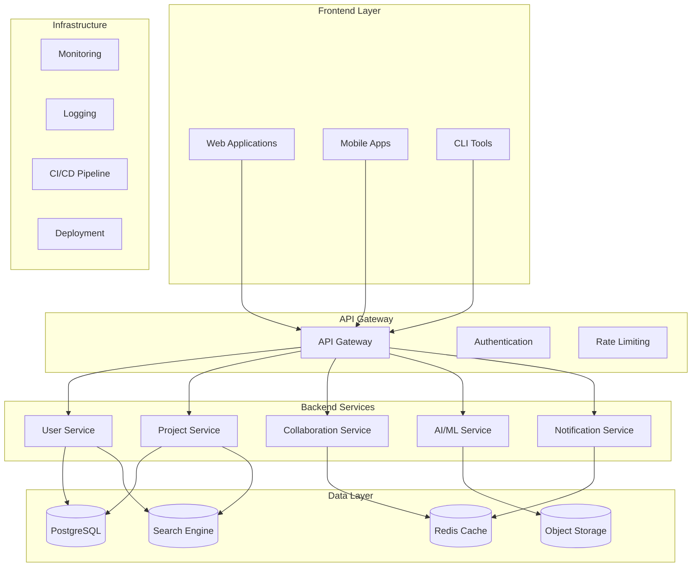
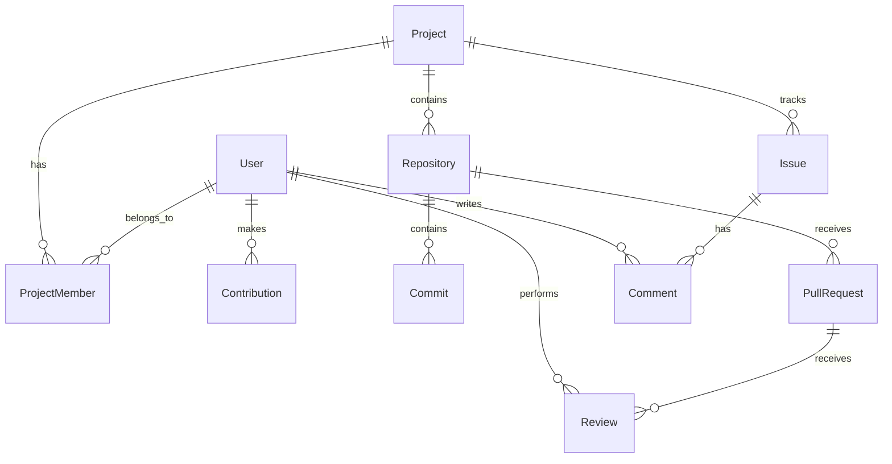
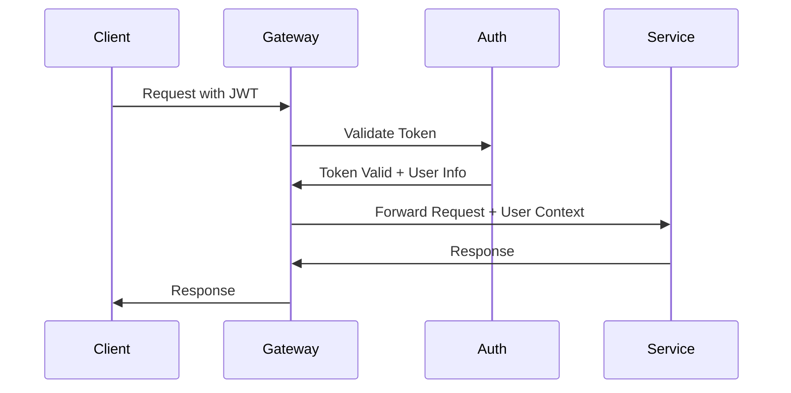
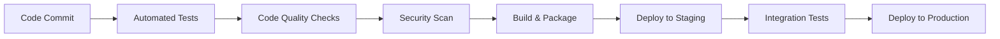

# Architecture: OpenLaunch

## Overview

OpenLaunch is designed as a modular, scalable platform that supports multiple concurrent projects while maintaining consistency, quality, and community collaboration through our annual Coding Party initiatives. Our architecture emphasizes flexibility, maintainability, and contributor accessibility.

## Design Principles

### 1. Modular Architecture
- **Separation of Concerns**: Each component has a clear, single responsibility
- **Loose Coupling**: Components interact through well-defined interfaces
- **High Cohesion**: Related functionality is grouped together
- **Plugin Architecture**: Easy to extend and customize

### 2. Community-Centric Design
- **Contributor Accessibility**: Clear structure that newcomers can understand
- **Collaborative Development**: Architecture supports multiple teams working simultaneously
- **Documentation-First**: Every component is thoroughly documented
- **Testing-Friendly**: Built-in support for comprehensive testing

### 3. Production-Ready Standards
- **Scalability**: Designed to handle growth in users and contributors
- **Security**: Security considerations built into every layer
- **Performance**: Optimized for speed and efficiency
- **Reliability**: Robust error handling and monitoring

### 4. Open Source Best Practices
- **Transparency**: All architectural decisions are documented and public
- **Standards Compliance**: Follows industry standards and conventions
- **Accessibility**: WCAG 2.1 AA compliance across all user interfaces
- **Internationalization**: Built-in support for multiple languages

---

## System Architecture

### High-Level Overview



### Component Breakdown

#### Frontend Layer
- **Web Applications**: React-based SPAs for different project types
- **Mobile Apps**: React Native apps for mobile collaboration
- **CLI Tools**: Command-line interfaces for developer workflows

#### API Gateway
- **Authentication**: JWT-based auth with OAuth2 providers
- **Rate Limiting**: Protect services from abuse
- **Request Routing**: Intelligent routing to backend services
- **API Versioning**: Support for multiple API versions

#### Backend Services
- **User Service**: User management, profiles, and permissions
- **Project Service**: Project lifecycle, repositories, and metadata
- **Collaboration Service**: Real-time collaboration features
- **AI/ML Service**: AI-powered features and recommendations
- **Notification Service**: Multi-channel notification system

#### Data Layer
- **PostgreSQL**: Primary database for structured data
- **Redis**: Caching and session storage
- **Object Storage**: File storage for assets and artifacts
- **Search Engine**: Full-text search capabilities

---

## Technology Stack

### Frontend Technologies

#### Web Applications
```yaml
Framework: React 18+
Language: TypeScript
Styling: Tailwind CSS + Styled Components
State Management: Zustand
Routing: React Router v6
Testing: Jest + React Testing Library
Build Tool: Vite
Package Manager: pnpm
```

#### Mobile Applications
```yaml
Framework: React Native
Language: TypeScript
Navigation: React Navigation v6
State Management: Zustand
Testing: Jest + React Native Testing Library
Build Tool: Expo
```

#### CLI Tools
```yaml
Language: Node.js + TypeScript
Framework: Commander.js
Testing: Jest
Build Tool: tsup
Distribution: npm
```

### Backend Technologies

#### API Services
```yaml
Runtime: Node.js 18+
Framework: Fastify
Language: TypeScript
Validation: Zod
ORM: Prisma
Testing: Jest + Supertest
Documentation: OpenAPI/Swagger
```

#### AI/ML Services
```yaml
Language: Python 3.11+
Framework: FastAPI
ML Libraries: scikit-learn, TensorFlow, PyTorch
Data Processing: pandas, numpy
Testing: pytest
Documentation: OpenAPI
```

### Infrastructure Technologies

#### Database
```yaml
Primary Database: PostgreSQL 15+
Cache: Redis 7+
Search: Elasticsearch 8+
Object Storage: AWS S3 / MinIO
```

#### DevOps
```yaml
Containerization: Docker + Docker Compose
Orchestration: Kubernetes (production)
CI/CD: GitHub Actions
Monitoring: Prometheus + Grafana
Logging: ELK Stack
```

---

## Project Structure

### Repository Organization

```
coding-party-2026/
├── .github/                 # GitHub templates and workflows
├── docs/                    # Documentation
├── design/                  # Design system and assets
├── frontend/               # Frontend applications
│   ├── web/               # Web applications
│   ├── mobile/            # Mobile applications
│   └── cli/               # CLI tools
├── backend/               # Backend services
│   ├── api-gateway/       # API gateway service
│   ├── user-service/      # User management service
│   ├── project-service/   # Project management service
│   ├── collab-service/    # Collaboration service
│   └── ai-service/        # AI/ML service
├── ai/                    # AI/ML components
│   ├── models/            # ML models and training
│   ├── data/              # Data processing pipelines
│   └── notebooks/         # Jupyter notebooks
├── infrastructure/        # Infrastructure as code
│   ├── docker/            # Docker configurations
│   ├── kubernetes/        # K8s manifests
│   └── terraform/         # Infrastructure definitions
├── scripts/               # Development and deployment scripts
├── community/             # Community resources
└── shared/                # Shared libraries and utilities
```

### Service Architecture

#### Microservices Pattern
Each backend service follows a consistent structure:

```
service-name/
├── src/
│   ├── controllers/       # HTTP request handlers
│   ├── services/          # Business logic
│   ├── models/            # Data models
│   ├── middleware/        # Custom middleware
│   ├── utils/             # Utility functions
│   └── types/             # TypeScript type definitions
├── tests/                 # Test files
├── docs/                  # Service-specific documentation
├── Dockerfile             # Container definition
├── package.json           # Dependencies and scripts
└── README.md              # Service overview
```

---

## Data Architecture

### Database Design

#### Core Entities


#### Data Models

**User Model**
```typescript
interface User {
  id: string
  email: string
  username: string
  displayName: string
  avatar?: string
  bio?: string
  skills: string[]
  interests: string[]
  githubUsername?: string
  linkedinProfile?: string
  timezone: string
  preferredLanguage: string
  createdAt: Date
  updatedAt: Date
}
```

**Project Model**
```typescript
interface Project {
  id: string
  name: string
  description: string
  category: ProjectCategory
  status: ProjectStatus
  visibility: 'public' | 'private'
  repositoryUrl: string
  documentationUrl?: string
  demoUrl?: string
  tags: string[]
  techStack: string[]
  difficulty: 'beginner' | 'intermediate' | 'advanced'
  estimatedHours: number
  createdBy: string
  createdAt: Date
  updatedAt: Date
}
```

### Caching Strategy

#### Redis Usage
- **Session Storage**: User sessions and authentication tokens
- **API Caching**: Frequently accessed API responses
- **Real-time Data**: Collaboration state and live updates
- **Rate Limiting**: Request counting and throttling
- **Queue Management**: Background job processing

#### Cache Patterns
- **Cache-Aside**: Manual cache management for complex queries
- **Write-Through**: Automatic cache updates on data changes
- **Write-Behind**: Asynchronous cache updates for performance
- **Refresh-Ahead**: Proactive cache refresh before expiration

---

## Security Architecture

### Authentication & Authorization

#### Authentication Flow


#### Security Measures
- **JWT Tokens**: Stateless authentication with short expiration
- **Refresh Tokens**: Secure token renewal mechanism
- **OAuth2 Integration**: GitHub, Google, and other providers
- **Role-Based Access Control**: Granular permissions system
- **API Rate Limiting**: Protection against abuse
- **Input Validation**: Comprehensive request validation
- **SQL Injection Prevention**: Parameterized queries and ORM
- **XSS Protection**: Content Security Policy and sanitization
- **HTTPS Everywhere**: TLS encryption for all communications

### Data Protection
- **Encryption at Rest**: Database and file storage encryption
- **Encryption in Transit**: TLS 1.3 for all network communication
- **Personal Data Handling**: GDPR-compliant data processing
- **Audit Logging**: Comprehensive security event logging
- **Backup Security**: Encrypted backups with access controls

---

## Performance Architecture

### Scalability Patterns

#### Horizontal Scaling
- **Load Balancing**: Distribute traffic across multiple instances
- **Database Sharding**: Partition data across multiple databases
- **Microservices**: Independent scaling of different components
- **CDN Integration**: Global content delivery for static assets

#### Performance Optimization
- **Database Indexing**: Optimized queries with proper indexes
- **Connection Pooling**: Efficient database connection management
- **Lazy Loading**: Load data only when needed
- **Pagination**: Efficient handling of large datasets
- **Compression**: Gzip compression for API responses
- **Image Optimization**: Automatic image resizing and format conversion

### Monitoring & Observability

#### Metrics Collection
- **Application Metrics**: Response times, error rates, throughput
- **Infrastructure Metrics**: CPU, memory, disk, network usage
- **Business Metrics**: User engagement, project success rates
- **Custom Metrics**: Domain-specific performance indicators

#### Logging Strategy
- **Structured Logging**: JSON-formatted logs with consistent fields
- **Correlation IDs**: Track requests across service boundaries
- **Log Levels**: Appropriate logging levels for different environments
- **Log Aggregation**: Centralized log collection and analysis

---

## Development Architecture

### Development Workflow

#### Git Strategy
- **Main Branch**: Production-ready code
- **Develop Branch**: Integration branch for features
- **Feature Branches**: Individual feature development
- **Release Branches**: Preparation for production releases
- **Hotfix Branches**: Critical production fixes

#### Code Quality
- **Linting**: ESLint, Prettier for consistent code style
- **Type Checking**: TypeScript for type safety
- **Testing**: Unit, integration, and end-to-end tests
- **Code Review**: Mandatory peer review for all changes
- **Automated Checks**: CI pipeline validation

#### Deployment Pipeline


### Testing Strategy

#### Test Pyramid
- **Unit Tests**: Fast, isolated tests for individual functions
- **Integration Tests**: Test component interactions
- **End-to-End Tests**: Full user workflow validation
- **Performance Tests**: Load and stress testing
- **Security Tests**: Vulnerability scanning and penetration testing

#### Test Coverage
- **Minimum Coverage**: 80% code coverage requirement
- **Critical Path Coverage**: 100% coverage for critical functionality
- **Mutation Testing**: Validate test quality with mutation testing
- **Visual Regression**: Automated UI change detection

---

## Deployment Architecture

### Environment Strategy

#### Development Environment
- **Local Development**: Docker Compose for local services
- **Feature Branches**: Automatic preview deployments
- **Shared Development**: Staging environment for integration testing

#### Production Environment
- **Blue-Green Deployment**: Zero-downtime deployments
- **Canary Releases**: Gradual rollout of new features
- **Rollback Strategy**: Quick rollback capability
- **Health Checks**: Automated health monitoring

### Infrastructure as Code
- **Terraform**: Infrastructure provisioning and management
- **Kubernetes**: Container orchestration and scaling
- **Helm Charts**: Application deployment templates
- **GitOps**: Git-based deployment automation

---

## Future Architecture Considerations

### Scalability Roadmap
- **Event-Driven Architecture**: Transition to event-based communication
- **CQRS Pattern**: Separate read and write operations
- **GraphQL Federation**: Unified API layer across services
- **Edge Computing**: Global edge deployment for performance

### Technology Evolution
- **WebAssembly**: High-performance client-side computing
- **Serverless Functions**: Event-driven serverless architecture
- **AI Integration**: Enhanced AI-powered features
- **Blockchain**: Decentralized governance and incentives

---

## Contributing to Architecture

### Architecture Decision Records (ADRs)
All significant architectural decisions are documented as ADRs in the `/docs/adr/` directory. Each ADR includes:
- Context and problem statement
- Considered options
- Decision and rationale
- Consequences and trade-offs

### Architecture Review Process
- **RFC Process**: Request for Comments for major changes
- **Community Input**: Open discussion for architectural decisions
- **Expert Review**: Technical review by experienced contributors
- **Implementation Planning**: Detailed implementation roadmap

### Getting Involved
- **Architecture Discussions**: Join our architecture working group
- **Code Reviews**: Participate in architectural code reviews
- **Documentation**: Help improve architectural documentation
- **Prototyping**: Build proof-of-concepts for new ideas

---

*This architecture document is continuously updated as our system evolves. For the latest information and to contribute to architectural decisions, visit our [architecture discussions](https://github.com/coding-party-2026/coding-party-2026/discussions/categories/architecture).*